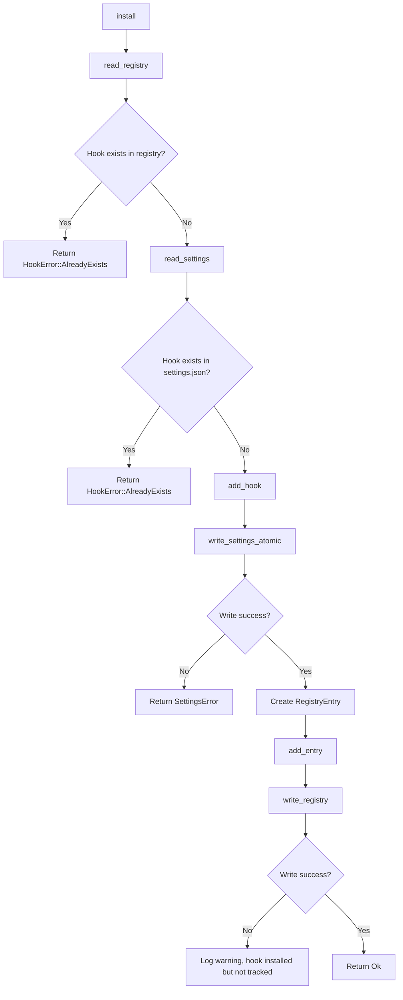
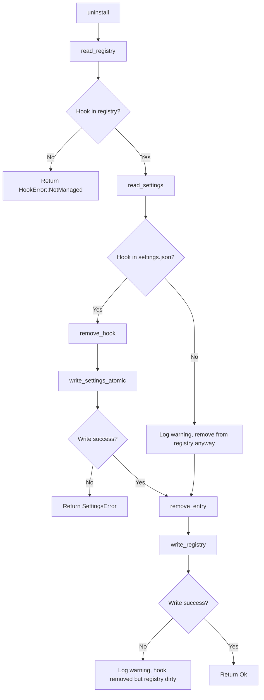
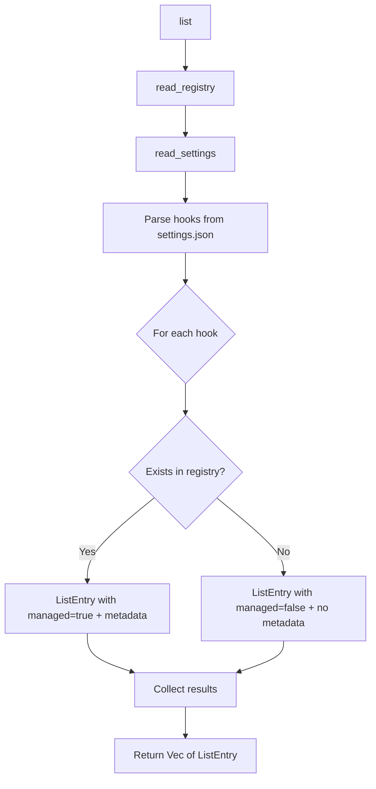

# claude-hooks Architecture (v0.1)

## Overview

This document specifies the technical architecture for claude-hooks v0.1, a library for managing Claude Code hooks programmatically. The scope is deliberately minimal: install, uninstall, and list operations for user-scope hooks only, with registry tracking and atomic file writes.

## Design Principles

1. **Boring technology for stability**: Standard JSON parsing, atomic file writes via rename, simple data structures
2. **User data first**: Claude's settings.json is sacred. We read it, preserve everything except hooks, and write atomically with safety copies
3. **Library-only in v0.1**: No CLI binary. ACD calls the Rust API directly. CLI ships in v0.2
4. **Zero-config**: All behavior is hardcoded or derived from XDG conventions. No configuration files for the crate itself

## Module Structure

```text
crates/claude-hooks/
├── Cargo.toml
├── docs/
│   ├── design-draft.md     # Design decisions (existing)
│   └── architecture.md     # This document
└── src/
    ├── lib.rs              # Public API
    ├── error.rs            # Error types (thiserror)
    ├── types.rs            # Core types (HookEvent, HookHandler, RegistryEntry)
    ├── settings.rs         # Claude settings.json I/O (atomic writes)
    └── registry.rs         # Local registry I/O (JSONC)
```

## Module Responsibilities

### lib.rs

Public API surface. Exposes three functions and all relevant types.

**Functions:**
- `install(event: HookEvent, handler: HookHandler, installed_by: &str) -> Result<()>`
- `uninstall(event: HookEvent, command: &str) -> Result<()>`
- `list() -> Result<Vec<ListEntry>>`

**Re-exports:**
- Error types from `error.rs`
- Core types from `types.rs`

**Notes:**
- No struct state. All functions are free functions
- User scope is hardcoded in v0.1 (no scope parameter)
- Library doc comment explains platform support, scope limitations

### error.rs

Error hierarchy using `thiserror`.

**Error Types:**
- `SettingsError`: I/O, parse, or write failures for settings.json
- `RegistryError`: I/O, parse, or write failures for registry
- `HookError`: Logical errors (hook already exists, not found, etc.)
- `Error`: Top-level enum wrapping all error variants

**Design:**
- Follows `claude-usage` pattern: enum variants use `#[error(...)]` for display
- All errors are `Send + Sync` for future async support
- Context strings include paths and hook identity where relevant

### types.rs

Core domain types. No business logic, pure data structures.

**Types:**
- `HookEvent`: Enum with 12 variants (Start, Stop, BeforePrompt, etc.)
- `HookHandler`: Struct representing hook configuration (type, command, matcher, timeout, async)
- `RegistryEntry`: Struct for registry storage (identity fields + metadata)
- `ListEntry`: Struct for list() output (hook + managed flag + metadata)

**Serialization:**
- `HookEvent` serializes to Claude's exact strings ("Start", "Stop", etc.)
- `HookHandler` serializes to Claude's settings.json hook structure
- `RegistryEntry` uses custom schema (see Registry Schema below)
- All types derive `Debug, Clone, Serialize, Deserialize`

**Hook Identity:**
- Composite key: `(event, matcher, type, command)`
- Implemented as derived `Eq + Hash` on those four fields
- Helper method: `RegistryEntry::matches(&self, event, command) -> bool`

### settings.rs

Reads and writes Claude's `~/.claude/settings.json` with atomic safety guarantees.

**Functions:**
- `settings_path() -> PathBuf`: Returns `~/.claude/settings.json`
- `read_settings() -> Result<serde_json::Value>`: Parses entire settings.json
- `write_settings_atomic(value: serde_json::Value) -> Result<()>`: Atomic write with rename
- `add_hook(value: serde_json::Value, event: HookEvent, handler: HookHandler) -> serde_json::Value`: Adds hook to hooks array
- `remove_hook(value: serde_json::Value, event: HookEvent, command: &str) -> serde_json::Value`: Removes exact match

**Atomic Write Strategy (D01):**
1. Create temp file in `~/.claude/` with name `settings.json.tmp.<timestamp>`
2. Write JSON to temp file
3. Flush to disk (`fsync`)
4. Rename temp file to `settings.json` (atomic operation)
5. On error before rename: keep temp file and log path as "safety copy"

**Timestamp Format (D03):**
- `yyyyMMdd-hhmmss` (17 chars with dash)
- Example: `20260202-143022`

**JSON Handling:**
- Parse with `serde_json` (standard JSON, no comments allowed in Claude's file)
- Preserve all top-level keys except `hooks`
- Never modify structure of other keys

### registry.rs

Manages the local registry in XDG data directory to track installed hooks.

**Functions:**
- `registry_path() -> PathBuf`: Returns `$XDG_DATA_HOME/claude-hooks/registry.jsonc`
- `read_registry() -> Result<Vec<RegistryEntry>>`: Parses registry file
- `write_registry(entries: Vec<RegistryEntry>) -> Result<()>`: Writes registry atomically
- `add_entry(entries: Vec<RegistryEntry>, entry: RegistryEntry) -> Vec<RegistryEntry>`: Adds entry
- `remove_entry(entries: Vec<RegistryEntry>, event: HookEvent, command: &str) -> Vec<RegistryEntry>`: Removes entry

**Registry File Format:**
- JSONC (JSON with comments)
- Schema version field for future migration
- Array of registry entries

**JSONC Parser (O01):**
- Use `json_comments` crate (simple, minimal dependencies)
- Parses JSONC to String, then feed to `serde_json`

**Registry Scope (D16, D20):**
- Only tracks hooks we installed (via this crate)
- Does not claim ownership of manually installed hooks
- Registry lives in user data directory (not per-project)

## Data Flow Diagrams

### Install Flow



**Error Handling:**
- If settings write fails: registry unchanged, return error
- If registry write fails after settings write: hook is installed but not tracked (log warning, return Ok)
- Rationale: Better to have hook installed and untracked than to fail after modifying settings.json

### Uninstall Flow



**Safety Invariant:**
- Only uninstall hooks we installed (matched via registry)
- If hook in registry but not in settings: still remove from registry (user may have manually deleted)

### List Flow



**Output:**
- All hooks from settings.json, regardless of who installed them
- Managed flag + metadata for hooks we installed
- No metadata for manually installed hooks

## Public API Surface

### Types

```rust
// Hook events (maps to Claude Code's event names)
#[derive(Debug, Clone, Copy, PartialEq, Eq, Hash, Serialize, Deserialize)]
pub enum HookEvent {
    Start,
    Stop,
    BeforePrompt,
    AfterPrompt,
    BeforeToolUse,
    AfterToolUse,
    BeforeEdit,
    AfterEdit,
    BeforeRevert,
    AfterRevert,
    BeforeRun,
    AfterRun,
}

// Hook handler configuration
#[derive(Debug, Clone, PartialEq, Eq, Serialize, Deserialize)]
pub struct HookHandler {
    pub r#type: String,     // "command" in v0.1
    pub command: String,    // Full command string with args
    pub matcher: String,    // Empty string for global hooks
    pub timeout: Option<u32>,     // Optional timeout in seconds
    pub r#async: Option<bool>,    // Optional async flag
}

// Registry entry (internal representation)
#[derive(Debug, Clone, PartialEq, Eq, Serialize, Deserialize)]
pub struct RegistryEntry {
    // Identity fields
    pub event: HookEvent,
    pub matcher: String,
    pub r#type: String,
    pub command: String,

    // Configuration fields
    pub timeout: Option<u32>,
    pub r#async: Option<bool>,

    // Metadata fields
    pub scope: String,              // "user" in v0.1
    pub enabled: bool,              // Always true in v0.1
    pub added_at: String,           // Timestamp (yyyyMMdd-hhmmss)
    pub installed_by: String,       // Free-form string (e.g., "acd")
    pub description: Option<String>,
    pub reason: Option<String>,
    pub optional: Option<bool>,
}

// List output entry
#[derive(Debug, Clone, PartialEq, Eq)]
pub struct ListEntry {
    pub event: HookEvent,
    pub handler: HookHandler,
    pub managed: bool,              // True if we installed it
    pub metadata: Option<RegistryMetadata>,  // Present if managed
}

// Subset of registry metadata for list output
#[derive(Debug, Clone, PartialEq, Eq)]
pub struct RegistryMetadata {
    pub added_at: String,
    pub installed_by: String,
    pub description: Option<String>,
    pub reason: Option<String>,
    pub optional: Option<bool>,
}
```

### Functions

```rust
/// Install a hook for the specified event.
///
/// # Arguments
/// * `event` - Hook event (Start, Stop, etc.)
/// * `handler` - Hook handler configuration (command, timeout, etc.)
/// * `installed_by` - Free-form string identifying installer (e.g., "acd")
///
/// # Errors
/// * `HookError::AlreadyExists` - Hook already exists (in registry or settings)
/// * `SettingsError` - Failed to read or write settings.json
/// * `RegistryError` - Failed to read registry (write failure is logged but not returned)
///
/// # Example
/// ```rust,ignore
/// use claude_hooks::{HookEvent, HookHandler, install};
///
/// let handler = HookHandler {
///     r#type: "command".to_string(),
///     command: "/path/to/stop.sh".to_string(),
///     matcher: String::new(),
///     timeout: Some(600),
///     r#async: None,
/// };
///
/// install(HookEvent::Stop, handler, "acd")?;
/// ```
pub fn install(
    event: HookEvent,
    handler: HookHandler,
    installed_by: &str,
) -> Result<()>;

/// Uninstall a hook for the specified event and command.
///
/// Only removes hooks installed via this crate (matched via registry).
///
/// # Arguments
/// * `event` - Hook event
/// * `command` - Exact command string
///
/// # Errors
/// * `HookError::NotManaged` - Hook not found in registry (not managed by us)
/// * `SettingsError` - Failed to read or write settings.json
/// * `RegistryError` - Failed to read registry (write failure is logged but not returned)
///
/// # Example
/// ```rust,ignore
/// use claude_hooks::{HookEvent, uninstall};
///
/// uninstall(HookEvent::Stop, "/path/to/stop.sh")?;
/// ```
pub fn uninstall(event: HookEvent, command: &str) -> Result<()>;

/// List all hooks from settings.json with management status.
///
/// Returns all hooks (managed and unmanaged). Managed hooks include metadata.
///
/// # Errors
/// * `SettingsError` - Failed to read or parse settings.json
/// * `RegistryError` - Failed to read or parse registry
///
/// # Example
/// ```rust,ignore
/// use claude_hooks::list;
///
/// for entry in list()? {
///     if entry.managed {
///         println!("Managed: {} - {}", entry.event, entry.handler.command);
///     } else {
///         println!("Unmanaged: {} - {}", entry.event, entry.handler.command);
///     }
/// }
/// ```
pub fn list() -> Result<Vec<ListEntry>>;
```

## Error Handling Strategy

### Error Hierarchy

```rust
#[derive(Debug, thiserror::Error)]
pub enum Error {
    #[error(transparent)]
    Settings(#[from] SettingsError),

    #[error(transparent)]
    Registry(#[from] RegistryError),

    #[error(transparent)]
    Hook(#[from] HookError),
}

#[derive(Debug, thiserror::Error)]
pub enum SettingsError {
    #[error("Settings file not found: {0}")]
    NotFound(PathBuf),

    #[error("Failed to read settings: {0}")]
    Io(#[from] std::io::Error),

    #[error("Failed to parse settings: {0}")]
    Parse(String),

    #[error("Failed to write settings atomically: {0}")]
    WriteAtomic(String),
}

#[derive(Debug, thiserror::Error)]
pub enum RegistryError {
    #[error("Failed to read registry: {0}")]
    Io(#[from] std::io::Error),

    #[error("Failed to parse registry: {0}")]
    Parse(String),

    #[error("Failed to write registry: {0}")]
    Write(String),
}

#[derive(Debug, thiserror::Error)]
pub enum HookError {
    #[error("Hook already exists: {event} - {command}")]
    AlreadyExists { event: String, command: String },

    #[error("Hook not managed by claude-hooks: {event} - {command}")]
    NotManaged { event: String, command: String },

    #[error("Invalid hook handler: {0}")]
    InvalidHandler(String),
}
```

### Error Context Strategy

- **File paths**: Include full path in error messages
- **Hook identity**: Include event + command in error messages
- **Safety copies**: On atomic write failure, log temp file path before returning error
- **Registry write failures**: Log as warnings (don't block operation if settings write succeeded)

### Logging

- Use `log` crate (same as claude-usage pattern)
- Log levels:
  - `error`: Failed atomic write, corrupt registry
  - `warn`: Registry write failed after settings write, missing registry entry for hook in settings
  - `debug`: Temp file paths, hook identity on match/no-match

## File Format Specifications

### Claude Code settings.json Structure

Location: `~/.claude/settings.json`

Format: Standard JSON (no comments)

Top-level keys (all preserved except hooks):
- `cleanupPeriodDays`
- `env`
- `permissions`
- `hooks` (array, modified by us)
- `statusLine`
- `enabledPlugins`
- `syntaxHighlightingDisabled`

Hook entry structure:
```json
{
  "event": "Stop",
  "matcher": "",
  "type": "command",
  "command": "/path/to/stop.sh $SESSION_ID $ARGS",
  "timeout": 600
}
```

Optional fields in hook entry:
- `timeout` (number, seconds)
- `async` (boolean)

### Registry File Format

Location: `$XDG_DATA_HOME/claude-hooks/registry.jsonc` (typically `~/.local/share/claude-hooks/registry.jsonc`)

Format: JSONC (JSON with comments allowed)

Schema (v1):
```jsonc
{
  // claude-hooks registry
  "schema_version": 1,
  "agent_name": "claude-code",
  "hooks": [
    {
      // Identity (composite key)
      "event": "Stop",
      "matcher": "",
      "type": "command",
      "command": "/path/to/stop.sh",

      // Configuration (not part of identity)
      "timeout": 600,
      "async": false,

      // Metadata
      "scope": "user",
      "enabled": true,
      "added_at": "20260202-143022",
      "reason": "Notify ACD daemon when Claude Code stops",
      "description": "Sets session status to 'attention' on Stop event",
      "optional": false,
      "installed_by": "acd"
    }
  ]
}
```

Fields:
- `schema_version`: Registry format version (1 for v0.1)
- `agent_name`: Always "claude-code" in v0.1
- `hooks`: Array of registry entries

Registry entry required fields:
- `event`, `matcher`, `type`, `command` (identity)
- `scope`, `enabled`, `added_at`, `installed_by` (metadata)

Registry entry optional fields:
- `timeout`, `async` (configuration)
- `reason`, `description`, `optional` (metadata)

## Dependencies

### Production Dependencies

```toml
[dependencies]
thiserror = "1"                  # Error types
serde = { version = "1", features = ["derive"] }
serde_json = "1"                 # Claude settings.json parsing
json-comments = "0.2"           # JSONC parsing for registry
chrono = "0.4"                  # Timestamp generation
log = "0.4"                     # Logging
dirs = "5"                      # XDG directory resolution
```

### Development Dependencies

```toml
[dev-dependencies]
tempfile = "3"                  # Temp directories for tests
env_logger = "0.11"             # Test logging output
```

### Justifications

- **json-comments**: Simplest JSONC parser (parses to string, then use serde_json)
- **chrono**: Standard for timestamp generation (existing dependency in workspace)
- **dirs**: Cross-platform XDG directory resolution
- **thiserror**: Error derive macros (same as claude-usage)

## Testing Strategy

### Unit Tests

**settings.rs:**
- Read/write roundtrip with temp files
- Atomic write failure scenarios (permission denied, disk full simulation)
- Preservation of non-hooks keys
- add_hook / remove_hook pure functions

**registry.rs:**
- Read/write roundtrip
- JSONC comment preservation
- Directory creation (if XDG dir doesn't exist)

**types.rs:**
- Serialization roundtrip for all types
- HookEvent string mapping
- RegistryEntry.matches() logic

### Integration Tests

**install flow:**
1. Fresh temp directory
2. Create minimal settings.json
3. Install hook
4. Verify settings.json updated
5. Verify registry created and contains entry
6. Attempt re-install (expect AlreadyExists error)

**uninstall flow:**
1. Install hook
2. Uninstall hook
3. Verify settings.json updated (hook removed)
4. Verify registry updated (entry removed)
5. Attempt re-uninstall (expect NotManaged error)

**list flow:**
1. Install 2 hooks via crate
2. Manually add 1 hook to settings.json
3. Call list()
4. Verify 3 entries returned
5. Verify 2 managed=true, 1 managed=false

**edge cases:**
- Registry write fails after settings write (install)
- Settings contains hook not in registry (list)
- Registry contains hook not in settings (uninstall)

## Security Considerations

1. **File permissions**: Settings file and registry should be readable/writable only by user
2. **Temp file cleanup**: On atomic write failure, temp file preserved for recovery (not auto-deleted)
3. **Command validation**: None (out of scope, caller responsible)
4. **Path traversal**: Use `dirs` crate for XDG resolution (no user input in path construction)

## Platform Support

**Supported:**
- macOS (primary development target)
- Linux (XDG conventions)

**Not supported in v0.1:**
- Windows (XDG conventions differ, deferred to v0.2+)

## Migration Path to v0.2

v0.1 → v0.2 additions:
- Multi-scope support (user/project/local)
- Export/import functions
- CLI binary

**Breaking changes:**
- `install()` / `uninstall()` / `list()` gain `scope` parameter
- Registry schema version bumped to 2 (add scope field to entries)

**Backward compatibility:**
- v0.1 registry files auto-migrated by setting all entries to scope="user"

## Open Questions

### O01: JSONC parser choice (RESOLVED)

**Decision:** Use `json-comments` crate. Simple, minimal dependencies, maintained.

### O06: Metadata fields in settings.json (DEFERRED)

**Question:** Can we add metadata fields directly into Claude Code's settings.json?

**Status:** Unknown. Test before v0.2. For now, metadata only in registry and exported files.

**Impact:** If Claude Code rejects unknown fields, we cannot store metadata in settings.json. Registry becomes source of truth.

## Notes

- All file paths in API responses and errors must be absolute
- Timestamps use format `yyyyMMdd-hhmmss` (D03)
- Hook identity is composite key, not hash (D22)
- installed_by is free-form string, not enum (D24)
- User scope only in v0.1 (D12, D25)
- Library-only, no CLI (D36)
